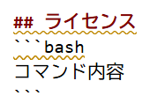

# streamlit-practice
streamlitの練習

## 起動方法
以下のコマンドアプリを起動できます
```bash
コマンド内容
```

このアプリはカードゲームを遊ぶためです。


website

## インストール
```bash
コマンド内容
```

## ライセンス
```bash
コマンド内容
```

## ライセンス
```bash
コマンド内容
```

## 画像
